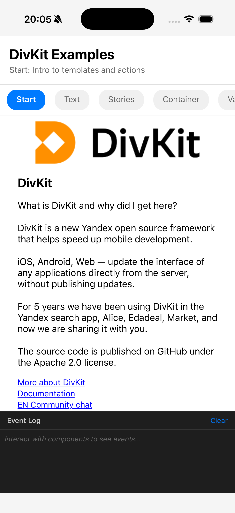
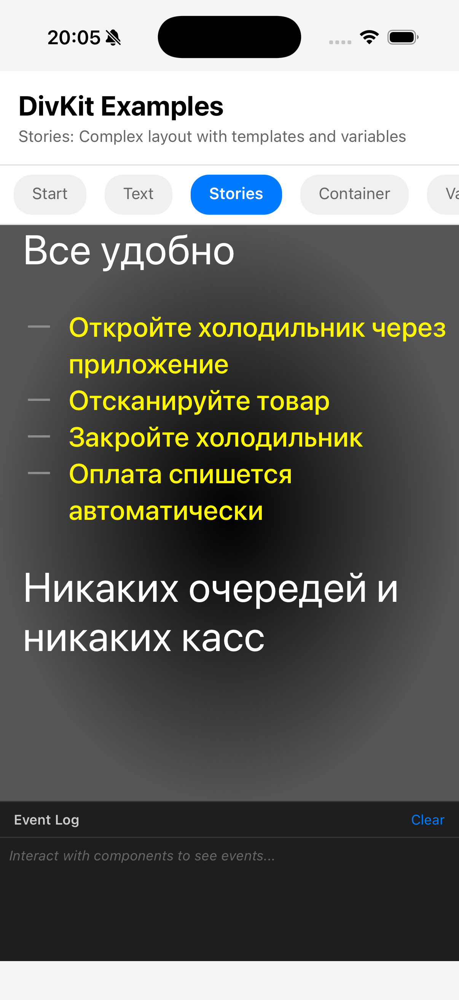
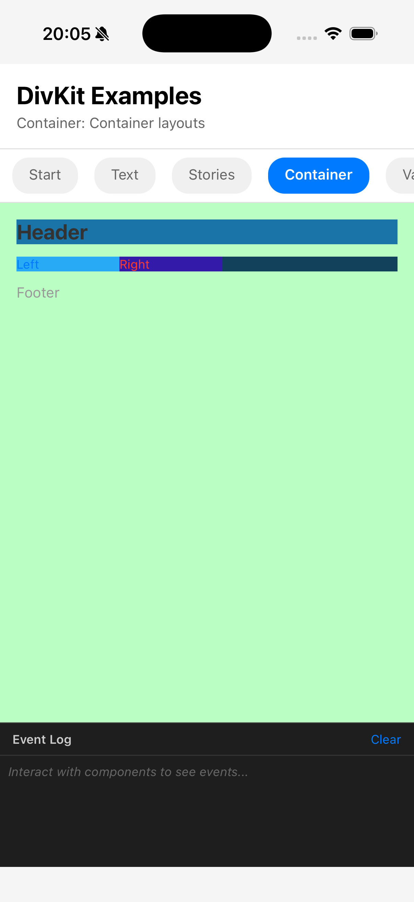
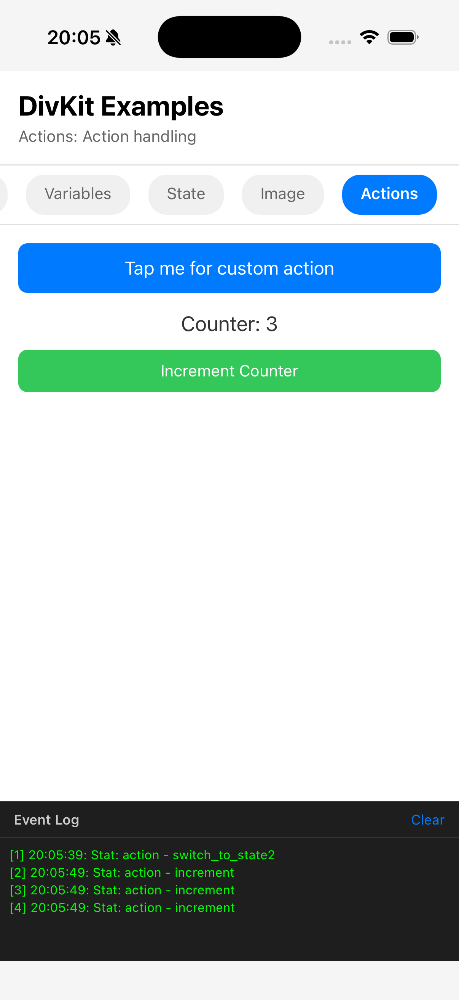

# react-native-divkit

Рендерер DivKit для React Native — фреймворк для Server-Driven UI.

[](LICENSE)
[](https://www.npmjs.com/package/react-native-divkit)

## Обзор

DivKit — это фреймворк для построения UI на основе данных с сервера (Server-Driven UI), который позволяет описывать макеты в формате JSON и рендерить их нативно. Данная реализация для React Native основана на веб-версии DivKit, переиспользуя движок выражений и адаптируя компоненты под React Native.

## Статус

**MVP Версия 0.1.0-alpha**

| Функция             | Статус      |
| ------------------- | ----------- |
| Текстовый компонент | ✅ Готово   |
| Компонент контейнера| ✅ Готово   |
| Компонент изображения| ✅ Готово  |
| Компонент состояния | ✅ Готово   |
| Система переменных  | ✅ Готово   |
| Движок выражений    | ✅ Готово   |
| Обработчики действий| ✅ Готово   |
| Подстановка шаблонов| ✅ Готово   |

## Скриншоты

<p>
  
  
  
  
</p>

## Установка

```bash
npm install react-native-divkit
```

### Опциональные зависимости

Для расширенной функциональности установите следующие пакеты:

```bash
# Оптимизированная загрузка изображений с кешированием
npm install react-native-fast-image

# Поддержка градиентов (фоны)
npm install react-native-linear-gradient

# Поддержка буфера обмена
npm install @react-native-clipboard/clipboard
```

## Быстрый старт

```tsx
import { DivKit } from 'react-native-divkit';

const divKitJson = {
    card: {
        log_id: 'hello_world',
        states: [
            {
                state_id: 0,
                div: {
                    type: 'text',
                    text: 'Привет, @{name}!',
                    font_size: 24,
                    text_color: '#000000',
                    text_alignment_horizontal: 'center'
                }
            }
        ],
        variables: [
            {
                type: 'string',
                name: 'name',
                value: 'Мир'
            }
        ]
    }
};

export default function App() {
    return (
        <DivKit
            data={divKitJson}
            onStat={stat => console.log('Статистика:', stat.type, stat.action.log_id)}
            onCustomAction={action => console.log('Кастомное действие:', action.url)}
            onError={error => console.error('Ошибка:', error.message)}
        />
    );
}
```

## Компоненты

### Text (Текст)

```json
{
    "type": "text",
    "text": "Привет, мир",
    "font_size": 16,
    "font_weight": "bold",
    "text_color": "#000000",
    "text_alignment_horizontal": "center",
    "max_lines": 2
}
```

### Container (Контейнер)

```json
{
    "type": "container",
    "orientation": "vertical",
    "items": [
        { "type": "text", "text": "Элемент 1" },
        { "type": "text", "text": "Элемент 2" }
    ],
    "content_alignment_horizontal": "center"
}
```

### Image (Изображение)

```json
{
    "type": "image",
    "image_url": "https://example.com/image.png",
    "scale": "fill",
    "width": { "type": "fixed", "value": 200 },
    "height": { "type": "fixed", "value": 150 }
}
```

### State (Состояние)

```json
{
    "type": "state",
    "id": "my_state",
    "default_state_id": "state1",
    "states": [
        {
            "state_id": "state1",
            "div": { "type": "text", "text": "Состояние 1" }
        },
        {
            "state_id": "state2",
            "div": { "type": "text", "text": "Состояние 2" }
        }
    ]
}
```

## Переменные

Объявление переменных в JSON:

```json
{
    "card": {
        "variables": [
            { "type": "string", "name": "userName", "value": "Мир" },
            { "type": "integer", "name": "counter", "value": 0 },
            { "type": "color", "name": "textColor", "value": "#FF0000" },
            { "type": "boolean", "name": "isActive", "value": true }
        ]
    }
}
```

Использование переменных в выражениях:

```json
{
    "type": "text",
    "text": "Привет, @{userName}!",
    "text_color": "@{textColor}"
}
```

### Типы переменных

| Тип       | Описание         | Пример             |
| --------- | ---------------- | ------------------ |
| `string`  | Текстовая строка | `"Hello"`          |
| `integer` | Целое число      | `42`               |
| `number`  | Дробное число    | `3.14`             |
| `boolean` | Логическое       | `true`             |
| `color`   | Цвет             | `"#FF5500"`        |
| `url`     | URL              | `"https://..."`    |
| `dict`    | Словарь (объект) | `{"key": "value"}` |
| `array`   | Список (массив)  | `[1, 2, 3]`        |

## Действия (Actions)

Действия вызываются при взаимодействии с пользователем:

```json
{
    "type": "text",
    "text": "Нажми меня",
    "actions": [
        {
            "log_id": "button_tap",
            "url": "divkit://custom_action"
        }
    ]
}
```

### Типизированные действия

#### set_variable (установка переменной)

```json
{
    "typed": {
        "type": "set_variable",
        "variable_name": "counter",
        "value": { "type": "integer", "value": 10 }
    }
}
```

#### set_state (смена состояния)

```json
{
    "typed": {
        "type": "set_state",
        "state_id": "my_state",
        "temporary_state_id": "state2"
    }
}
```

## Свойства (Props)

| Свойство         | Тип                    | Обязательно | Описание                           |
| ---------------- | ---------------------- | ----------- | ---------------------------------- |
| `data`           | `DivJson`              | Да          | JSON-данные DivKit                 |
| `onStat`         | `(stat) => void`       | Нет         | Колбэк статистики                  |
| `onCustomAction` | `(action) => void`     | Нет         | Обработчик кастомных действий      |
| `onError`        | `(error) => void`      | Нет         | Обработчик ошибок                  |
| `direction`      | `'ltr' \| 'rtl'`       | Нет         | Направление текста (по умолч.: `'ltr'`) |
| `platform`       | `'desktop' \| 'touch'` | Нет         | Тип платформы (по умолч.: `'touch'`) |
| `style`          | `ViewStyle`            | Нет         | Стили контейнера                   |

## Хуки

Для продвинутого использования вы можете использовать хуки напрямую:

```tsx
import { useDivKitContext, useVariable, useVariableState, useAction } from 'react-native-divkit';

function MyComponent() {
    const { setVariable } = useDivKitContext();
    const counter = useVariable('counter');

    return (
        <View>
            <Text>Счетчик: {counter}</Text>
            <Button onPress={() => setVariable('counter', counter + 1)} title="Увеличить" />
        </View>
    );
}
```

## Примеры

Смотрите директорию [examples/BasicExample](examples/BasicExample/) для готового React Native приложения, демонстрирующего все возможности.

```bash
cd examples/BasicExample
npm install
npm run ios   # или npm run android
```

## Документация

- [Справочник API](docs/API.md) - Полная документация API
- [Руководство по миграции](docs/MIGRATION.md) - Миграция с веб-версии
- [Архитектура](docs/ARCHITECTURE.md) - Внутренняя архитектура

## Не включено в MVP

Следующие функции запланированы для будущих версий:

- Gallery (Галерея), Pager (Пейджер), Slider (Слайдер), Tabs (Вкладки)
- Input (Ввод), Select (Выбор), Switch (Переключатель)
- Видео, Lottie-анимации
- Диапазоны текста, сложные градиенты
- Продвинутые переходы и анимации
- API пользовательских компонентов

## Архитектура

Библиотека основана на DivKit Web (TypeScript + Svelte):

| Компонент         | Переиспользование       |
| ----------------- | ----------------------- |
| Движок выражений  | 100% скопировано        |
| Определения типов | 100% скопировано        |
| Утилиты           | ~90% адаптировано       |
| Компоненты        | ~20% (переписано под RN)|
| Система контекстов| Новая (специфично для React)|

## Разработка

```bash
# Установка зависимостей
npm install

# Сборка парсера PEG
npm run build:peggy

# Проверка типов
npm run typecheck

# Линтинг
npm run lint

# Сборка
npm run build

# Тесты
npm test
```

## Лицензия

Apache 2.0
